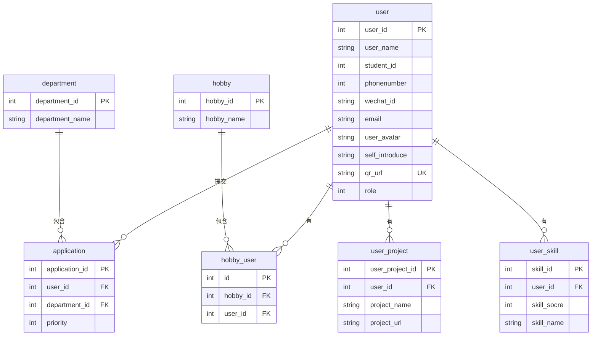

# 小程序实体关系图



## 关系说明

1. 一个部门(department)可以包含多个志愿(application)
2. 一个兴趣(hobby)可以包含多个用户兴趣(hobby_user)
3. 一个用户(user)可以提交多个志愿(application)
4. 一个用户(user)可以有多个兴趣(hobby_user)
5. 一个用户(user)可以有多个项目(user_project)
6. 一个用户(user)可以有多个技能(user_skill)

## 实体说明

### department (部门表)
- 存储部门信息
- department_name字段唯一

### hobby (兴趣表)
- 存储兴趣信息

### user (用户表)
- 存储用户信息
- 包含用户名、学号、手机号、微信号、邮箱号、用户头像、自我介绍、二维码URL和角色

### application (志愿表)
- 存储用户提交的志愿信息
- 包含用户ID、部门ID和优先级

### hobby_user (中间表)
- 存储用户兴趣信息
- 包含兴趣ID和用户ID

### user_project (用户项目)
- 存储用户项目信息
- 包含项目名称和项目链接

### user_skill (技能及其评估)
- 存储用户技能信息
- 包含技能名称和评分
````
